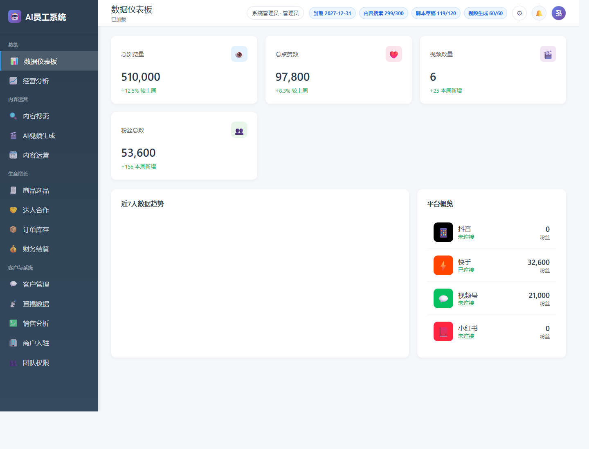
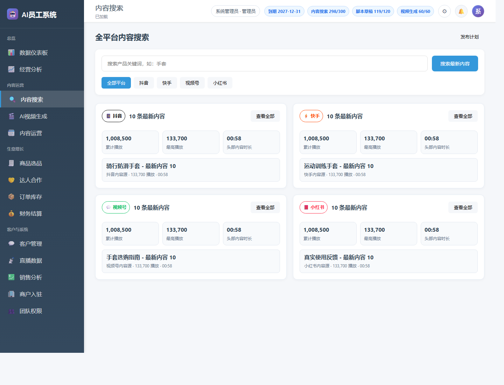
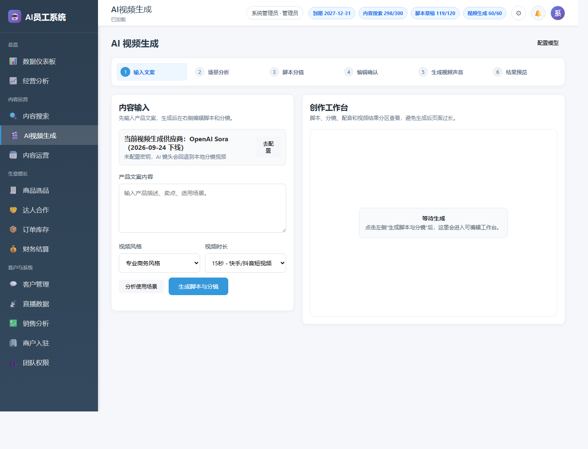
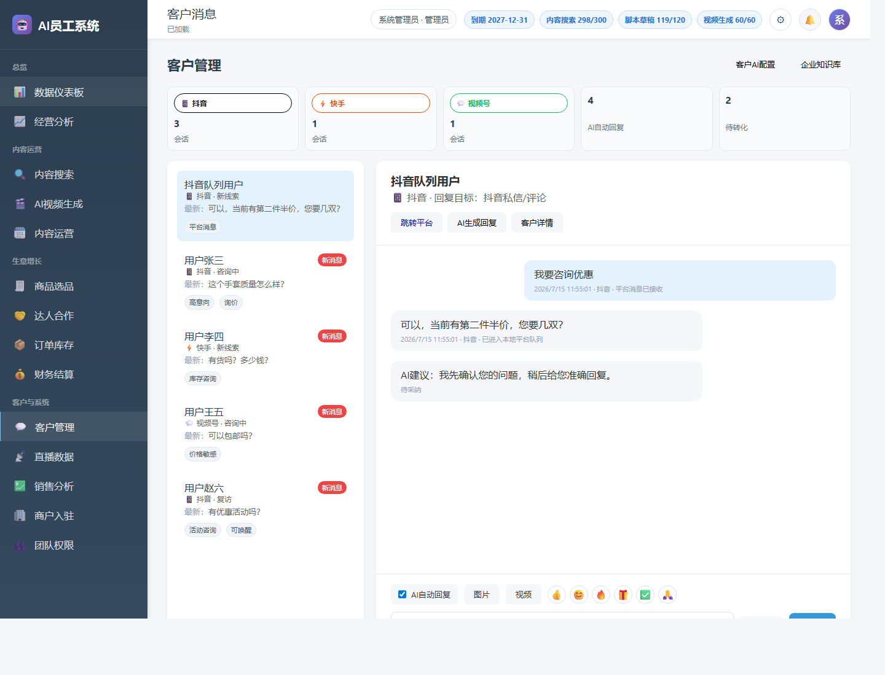
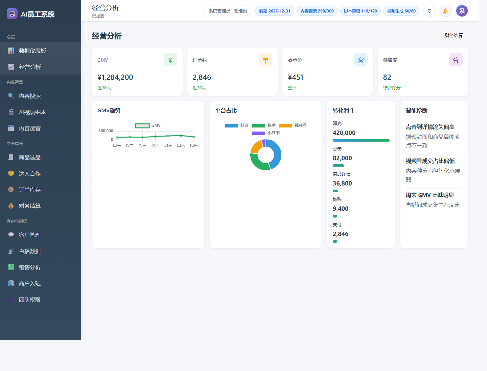
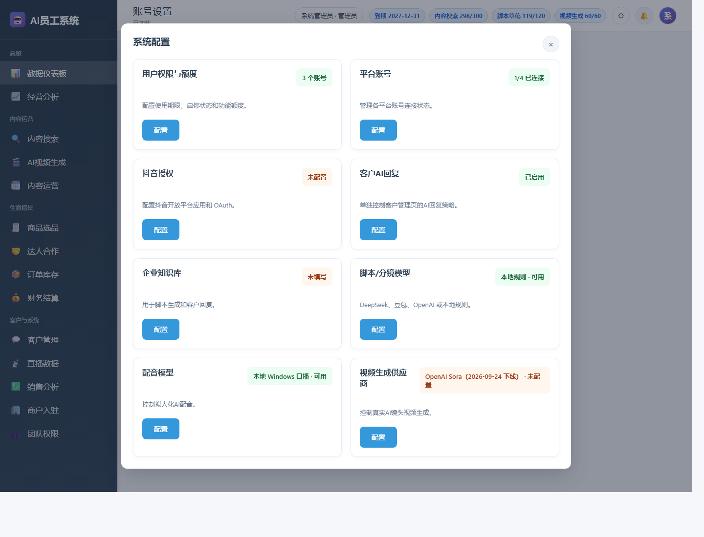

# AI Employee Prototype App

Chinese documentation: [README.md](README.md)

AI Employee Prototype App is a local prototype for multi-platform content operations, AI video generation, customer messaging, merchant onboarding, product selection, publishing plans, creator cooperation, team permissions, and business analytics.

## What It Solves

This project demonstrates how an AI employee can support a merchant from content discovery to video creation, scheduled publishing, platform message handling, and business analysis. It is designed as an offline-runnable prototype with configurable provider adapters, so the core workflow can be verified locally before connecting official platform and AI vendor APIs.

The code is organized by responsibility: static frontend pages stay in `public/`, backend APIs are grouped in `src/modules/`, AI and media provider logic lives in `src/services/`, and runtime data access is routed through `src/db/`.

## Features

- Multi-platform content search
- AI script and storyboard generation
- Local voice and video rendering
- AI video provider configuration
- OpenAI, Aliyun Wanxiang/Kling, Volcengine Seedance, Tencent TokenHub, and Baidu Qianfan video adapters
- Customer messaging and local platform message gateway
- Customer AI reply configuration and knowledge base
- Publishing plans and platform queue status
- AI task center backend, approval requests, knowledge retrieval, platform capability records, and ROI metrics
- Product selection with multi-platform links
- Creator cooperation process
- Merchant onboarding and simulated review code
- Team members, roles, audit chart, and audit detail
- Douyin OAuth configuration foundation

## Screenshots

| Dashboard | Content Search |
| --- | --- |
|  |  |

| AI Video | Customer Management |
| --- | --- |
|  |  |

| Operations Analytics | System Settings |
| --- | --- |
|  |  |

## Main Workflow

1. Search content across platforms and classify results by platform.
2. Select product or scenario, then generate script and storyboard.
3. Review and edit the AI output before rendering.
4. Choose voice and video provider, then render locally or through vendor APIs.
5. Schedule publishing and monitor platform queue status.
6. Reply to customer messages with configurable AI and knowledge base.
7. Review operation metrics, ROI, approvals, and audit logs.

## Requirements

Install these before running the project:

- Node.js 18 or later
- npm
- Windows PowerShell is recommended for local voice rendering

The project uses `@ffmpeg-installer/ffmpeg`, so FFmpeg will be installed by npm.

## Install

```powershell
git clone https://github.com/lgpassword/ai-employee-prototype-app.git
cd ai-employee-prototype-app
npm install
```

If you are running from an existing local directory:

```powershell
cd D:\github\ai-employee-prototype-app
npm install
```

## Start

```powershell
npm start
```

Default local URL:

```text
http://127.0.0.1:3201
```

## Validate

```powershell
npm run check
```

This command checks the syntax of backend modules, services, and frontend JavaScript.

## Demo Accounts

```text
Admin: admin / admin123
Personal: user / user123
Merchant: merchant / merchant123
```

## Project Structure

```text
.
├── .github/
│   ├── CODEOWNERS
│   └── pull_request_template.md
├── .planning/
│   ├── PROJECT.md
│   ├── REQUIREMENTS.md
│   ├── ROADMAP.md
│   └── phases/
├── docs/
│   ├── API_REFERENCE.md
│   ├── AI_EMPLOYEE_MODIFICATION_GUIDE.md
│   ├── CO_CREATION_INVITE.md
│   ├── CODE_MAP.md
│   ├── GITHUB_RELEASE.md
│   └── screenshots/
├── public/
│   ├── index.html
│   ├── app.js
│   └── styles.css
├── src/
│   ├── server.js
│   ├── store.js
│   ├── db/
│   │   ├── index.js
│   │   ├── state.js
│   │   └── json-store.js
│   ├── modules/
│   └── services/
├── .gitignore
├── LICENSE
├── package.json
├── package-lock.json
├── README.md
└── README_EN.md
```

See:

- `docs/CODE_MAP.md` for file-by-file responsibilities and flow descriptions.
- `.planning/ROADMAP.md` for GSD phase planning based on the modification guide.
- `docs/API_REFERENCE.md` for API and backend method mapping.
- `docs/CO_CREATION_INVITE.md` for co-creation invitation, operation flow, modules, and contribution directions.
- `docs/GITHUB_RELEASE.md` for GitHub publishing and branch protection.

## Runtime Data

These directories are intentionally ignored by Git:

```text
node_modules/
.local/
public/generated/
.env
.env.*
```

Why:

- `node_modules/`: installed dependencies; restore with `npm install`.
- `.local/`: local logs, OAuth cache, runtime data, possible secrets. The transitional business snapshot is `.local/store.json`.
- `public/generated/`: generated videos, audio, clips, storyboard artifacts.
- `.env`: local API keys and secrets.

The transitional persistence layer reads `.local/store.json` when the service starts and saves business state after API requests. The global login `session` is not written to the snapshot.

Backend business modules access data through `src/db/index.js`. `src/db/state.js` stores runtime state and default demo data. `src/store.js` is kept only as a compatibility layer for older imports.

## AI Provider Configuration

You can configure providers inside the app:

- Script and storyboard model
- Voice model
- Video generation provider
- Customer AI reply model
- Enterprise knowledge base

Secrets are kept locally and should not be committed to GitHub.

## Platform Messaging Gateway

The app includes a local platform messaging gateway:

```text
GET  /api/platform-messaging/status
POST /api/platform-messaging/inbound
POST /api/conversations/:id/platform-reply
```

Authorization does not block the business flow. If a platform is not authorized, messages enter the local platform queue. After official authorization and message API permissions are available, the same adapter layer can send to the real platform.

## GitHub Publishing

```powershell
cd D:\github\ai-employee-prototype-app
git remote add origin https://github.com/lgpassword/ai-employee-prototype-app.git
git branch -M main
git push -u origin main
```

See `docs/GITHUB_RELEASE.md` for branch protection and release notes.

## Branch Protection

The repository includes:

```text
.github/CODEOWNERS
.github/pull_request_template.md
```

For this personal GitHub repository, only the owner has write access by default. Keep collaborators without write permission, enable branch protection for `main`, and disable force pushes and branch deletion.

## License

MIT License. See `LICENSE`.

## Common Issues

### Can another computer run this project directly?

Yes, after installing Node.js and dependencies:

```powershell
npm install
npm start
```

### Are generated videos uploaded to GitHub?

No. `public/generated/` is ignored.

### Are API keys uploaded?

No. `.env` and `.local/` are ignored.
